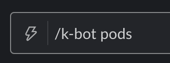
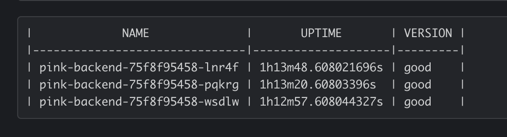
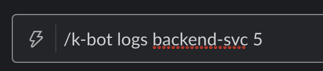
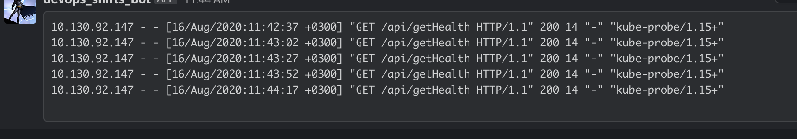

# Devops Task

## What is it

slack chatbot

## Available Commands

```console
/k-bot pods
```
 
 

```console
/k-bot logs [service] [tail]
```
 
 

## metrics:

k-bot exports metrics on the same port as the app (defaults to `1012`) on `/metrics` route
In addition to usage metrics, a custom metric is also exported:
### kbot_requests_total
- *Type:* Counter
- *Labels:* command, userID

## Installation 
- create the signing secret (from slack)
```console
~ $ k create secret generic k-bot-slack-secret --from-literal secret=xxxxxx 
```
- Install the [helm3 chart](./chart). In `values.yaml`, you will have to provide the ingress host name, slack signing secret details, and enable rbac if your cluster needs it.
```console
~ $ helm3 install chart/k-bot --generate-name --namespace default
NAME: k-bot-1597572730
LAST DEPLOYED: Sun Aug 16 13:12:13 2020
NAMESPACE: default
STATUS: deployed
REVISION: 1
NOTES:
1. Get the application URL by running these commands:
  http://k-bot.yourdomain.io/

```
## Tests
```console
~ $ cd src
~ $ go test
Registering counter vector
PASS
ok      github.com/Efrat19/devops-task/src      0.683s
```

## Meeting Task Requirements
> 1.Production-readiness: code should be reliable, tested and clean.

- Small reusable functions
- The code follows clean code principles  
- The code follows Go error handling best practices

> 2.Developer Experience (DX): deliver easy-to-use, self-service experience.
- Command Help Text
- Markdown Formatting

> 3.Security.

The code uses slack built-in token-based authentication to secure the communication using a [signing secret](https://api.slack.com/authentication/verifying-requests-from-slack#about)

>4.Observability: easily investigate and learn how the bot is being used.
- Various log levels (`debug`, `info`, `warn` and `error`)
- Clear error messages
- usage metrics exported in prometheus-readable format

## Projects Steps
- [X] k8s client: 
  - get name, age, and /version of each running pod
  - get x log lines
- [X] slack server
  - accept slash command
- [X] expose metrics
  - requests counter
- [X] tests
- [X] errors handling
- [X] logs

